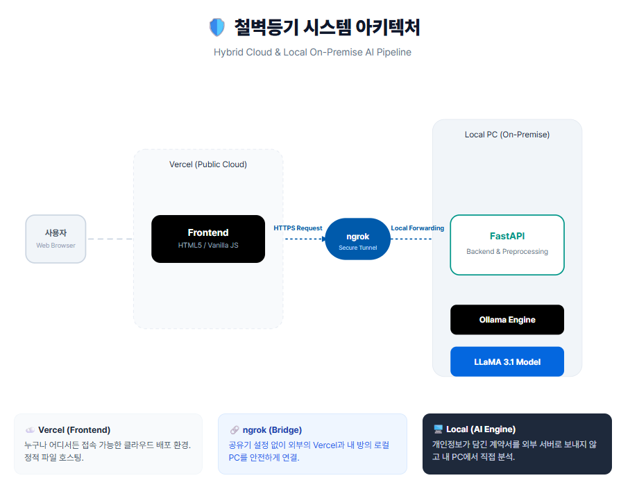

# 🛡️ 철벽등기 (Chul-Byeok Deung-Gi)
> **"사기꾼의 꼼수가 통하지 않는 철벽 방어 AI"**
> *청년과 사회초년생을 위한 부동산 계약서 및 등기부등본 AI 자동 판독기*


---

## 📑 목차
1. [프로젝트 배경 및 문제 상황](#1-프로젝트-배경-및-문제-상황)
2. [해결 방안](#2-해결-방안)
3. [주요 기능](#3-주요-기능)
4. [기존 서비스와의 차별점](#4-기존-서비스와의-차별점)
5. [시스템 아키텍처](#5-시스템-아키텍처)
6. [기술 스택](#6-기술-스택)
7. [설치 및 실행 방법](#7-설치-및-실행-방법)
8. [향후 발전 방향](#8-향후-발전-방향)

---

## 1. 프로젝트 배경 및 문제 상황 🚨
최근 대한민국을 뒤흔든 **'전세사기'**는 단순한 금전적 손실을 넘어 청년 세대의 미래를 위협하고 있습니다.

* **법률 용어의 비대칭성:** '근저당', '가압류', '신탁' 등 일상생활에서 접하기 힘든 한자어와 법률 전문 용어는 사기꾼들이 파고드는 가장 큰 허점입니다.
* **지능화된 신탁 사기:** 실소유주가 신탁회사임에도 임대인이 본인 소유인 것처럼 속여 보증금을 가로채는 신탁 사기는 세입자가 법적 보호를 받기 매우 어렵게 만듭니다.
* **보이지 않는 독소조항:** 계약서 하단 특약 사항에 숨겨진 세입자에게 일방적으로 불리한 조항들은 나중에 거대한 분쟁의 씨앗이 됩니다.

## 2. 해결 방안 💡
**"부동산 계약 현장에서 즉시 꺼내는 AI 법률 방패"**

**철벽등기**는 복잡한 절차나 결제 없이, 중개소 현장에서 받은 등기부등본이나 계약서를 **사진 찍거나 텍스트를 입력하는 즉시** 로컬 LLM이 문맥을 분석합니다. 치명적인 위험 요소를 신호등 색깔(🟢안전/🟡주의/🔴위험)로 표시하여 사회초년생이 현장에서 당당하게 권리를 주장할 수 있도록 돕습니다.

---

## 3. 주요 기능 ✨

### 🔴 신탁 사기 원천 차단 (갑구 분석)
* 등기부등본 갑구에 기재된 소유권 정보를 실시간 분석하여 '신탁' 여부를 판독합니다.
* 신탁 매물일 경우 임대인과의 직접 계약이 가진 법적 위험성을 경고하고 필수 확인 서류를 안내합니다.

### 🟡 권리관계 정밀 스캔 (을구 분석)
* 을구의 '근저당권설정', '가압류' 등 채권 내역을 파악합니다.
* 사용자의 보증금 규모와 대조하여 경매 진행 시 보증금 회수 가능 여부를 초보자의 눈높이에서 설명합니다.

### 🟠 특약 독소조항 자동 적출
* 임대차 계약서 내 '특약사항' 전체를 텍스트 마이닝합니다.
* 수리비 전가, 보증금 반환 조건 악용 등 세입자에게 불리한 꼼수 조항을 찾아내어 수정을 제안합니다.

---

## 4. 기존 서비스와의 차별점 🆚
**철벽등기**는 전문가용 분석 툴이 아닌, **'현장용 자가진단 키트'**에 집중합니다.

* **현장 즉시성 (vs 세이프홈즈):** 주소 입력 후 데이터를 수집하는 시간을 기다릴 필요 없이, 눈앞의 종이 문서를 즉시 분석하여 결정을 돕습니다.
* **특약 중심 추론 (vs 앨리비 등 전문 리걸테크):** 정형화된 데이터가 아닌, 사람의 의도가 담긴 '특약 문장'의 위험성을 LLM의 추론 능력으로 정확히 파악합니다.

---

## 5. 시스템 아키텍처 🏗️


데이터 보안과 비용 효율성을 위해 **클라우드 프론트엔드 + 로컬 온프레미스 AI 백엔드 하이브리드 구조**를 채택했습니다.

1. **Client (Vercel):** 경량화된 HTML/JS 기반 UI로 어디서든 빠르게 접속.
2. **Tunneling (ngrok):** 외부 클라우드와 내부 AI 서버를 잇는 안전한 통로 제공.
3. **Backend (FastAPI - 로컬 PC):** 무거운 AI 모델을 개인 PC에서 구동하여 서버 유지 비용 0원 달성.
4. **AI Engine (Ollama + LLaMA 3.1):** 온프레미스 환경에서 개인 정보 유출 없이 강력한 문맥 분석 수행.

---

## 6. 기술 스택 🛠️
* **Frontend:** HTML5, CSS3, Vanilla JavaScript (Vercel)
* **Backend:** Python 3.10+, FastAPI (Local Server)
* **AI Model:** LLaMA 3.1 (via Ollama)
* **Tooling:** ngrok (Tunneling)

---

## 7. 설치 및 실행 방법 🚀

# 필수 라이브러리 설치
pip install -r requirements.txt

# PaddleOCR GPU 작동 테스트
python -c "from paddleocr import PaddleOCR; ocr = PaddleOCR(use_gpu=True, lang='korean'); print('🚀 GPU OCR Ready!')"

### 요구 사항
* Python 3.10+
* [Ollama](https://ollama.com/) 설치 및 `llama3.1` 모델 다운로드 (`ollama run llama3.1`)
* ngrok 설치 및 인증 완료

### 백엔드 실행 (로컬 PC)
```bash
# 1. 서버 실행
uvicorn app:app --host 0.0.0.0 --port 8000 --reload

# 2. 외부 터널 개방
ngrok http 8000